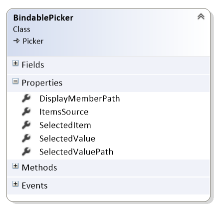

# Xamarin Forms BindablePicker

After downloading or cloning, you **MUST** right-click the solution and select "Restore NuGet Packages."

After restoring, I always **restart Visual Studio**. I know you shouldn't have to do this, but I found it covers 95% of my headaches.

## Introduction
This repro contains the updated Xamarin Forms BindablePicker control (8/12/2016 Release).

This control is a replacement for the Xamarin Forms Picker.

## Demo Project
The XamarinFormsBiundablePicker project is a simple Xamarin Forms, UWP project that demonstrates usage scenarios for the BindablePicker.

The BindablePicker class is in the Controls folder, grap this file and add to your projects.

## Features

**new**  BindablePicker supports binding the ItemsSource to an ObservableCollection (8/12/2016 Release)

**bug fix** Corrected the ItemsSource implementation, that failed to reload new collections property when the selected item was immediately reset after refreshing the ItemsSource. (8/12/2016 Release)



- **DisplayMemberPath** used in conjunction with the SelectedValue property, determines which property will be displayed in the picker.
- **ItemsSource** bindable, supports ObservableCollections and collections that implment INotifyCollectionChanged.
- **SelectedItem** bindable, used when the ItemsSource is a collection of strings
- **SelectedValue** bindable, used in conjunctin with DisplayMememberPath, and SelectedValuePath, is set to the value of the SelectedValuePath when an item is selected.
- **SelectedValuePath** used in conjunction with the SelectedValue property, determines which property will be returned by the SelectedValue property when an item is seleced in the picker.

## Usage

**SelectedItem - Collection of strings, data bound to a string model property**

```
<controls:BindablePicker
    ItemsSource="{Binding Path=VacationSpots}"
    SelectedItem="{Binding Path=Person.NextVacationSpot, Mode=TwoWay}" />
```

**SelectedItem - Collection of strings, data bound to an enum model property, uses enum converter**

```
<controls:BindablePicker
    ItemsSource="{Binding Path=Sexes}"
    SelectedItem="{Binding Path=Person.Sex, Mode=TwoWay, 
                    Converter={StaticResource SexEnumConverter}}" />
```

**SelectedValue - Collection of Country objects, data bound to a string model property**

```
<controls:BindablePicker
    ItemsSource="{Binding Path=Countries}"
    DisplayMemberPath="Name"
    SelectedValuePath="Abbreviation"
    SelectedValue="{Binding Path=Person.Country, Mode=TwoWay}" />
```

**Example of adding a new item to the source collection, item is added to the BindablePicker Items.**

Code from the PersonEditorViewModel.cs file

```
void AddOnItemToVacationSpotsExecute() {
    this.VacationSpots.Add("Hawaii");
}
```

**Example of refreshing the ItemsSource and resetting the selected item.**

In the below code, the SelectedItem on the BindablePicker is bound to the Person.NextVacationSpot property.

Code from the PersonEditorViewModel.cs file

```
void RefreshVacationSpotsExecute() {
    // simulates the vacations spots being refreshed from the data base.
    var list = this.VacationSpots.ToList();
    list.Add($"New Spot {DateTime.Now.ToLocalTime()}");
    this.VacationSpots = new ObservableCollection<String>(list);
    this.Person.NextVacationSpot = list.Last();
}
```